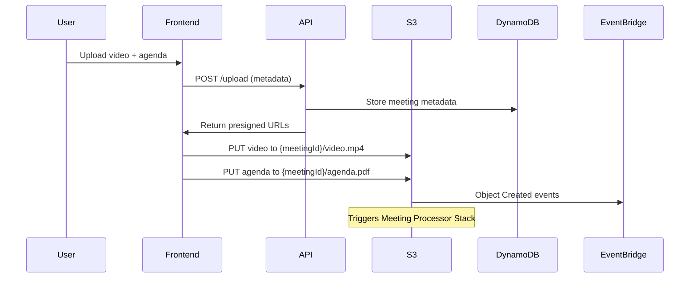
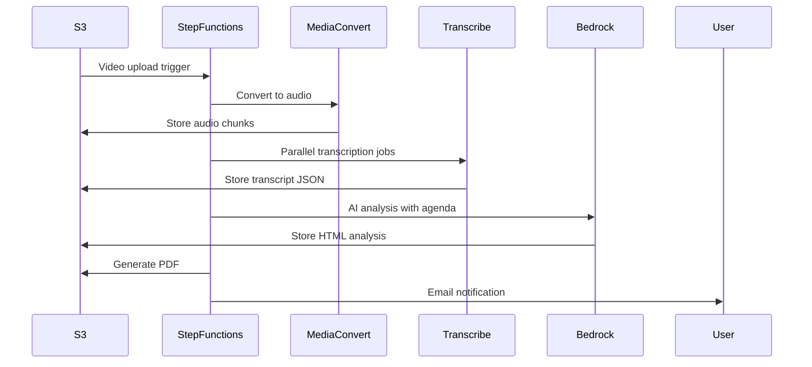

# Semantic Lighthouse - Comprehensive Technical Documentation

## Production Integration & Stack Merging Guide

**Version**: 1.0  
**Date**: January 2025  
**Purpose**: Comprehensive documentation for integrating the UI and Meeting Processor stacks with a third-party stack and transitioning to production.

---

## Table of Contents

1. [Application Overview](#1-application-overview)
2. [Architecture Components](#2-architecture-components)
3. [UI Stack Analysis](#3-ui-stack-analysis)
4. [Meeting Processor Stack Analysis](#4-meeting-processor-stack-analysis)
5. [Data Flow Workflows](#5-data-flow-workflows)
6. [Configuration Management](#6-configuration-management)
7. [S3 Bucket Structure & Data Paths](#7-s3-bucket-structure--data-paths)
8. [Environment Variables & Hardcoded Values](#8-environment-variables--hardcoded-values)
9. [Critical Integration Points](#9-critical-integration-points)
10. [Database Schema Recommendations](#10-database-schema-recommendations)
11. [Security & Permissions Model](#11-security--permissions-model)
12. [Monitoring & Error Handling](#12-monitoring--error-handling)
13. [Production Readiness Checklist](#13-production-readiness-checklist)

---

## 1. Application Overview

### 1.1 Purpose

Semantic Lighthouse is a comprehensive solution for automatically processing board meeting videos into searchable, analyzable transcripts with AI-powered summaries and interactive PDF outputs.

### 1.2 High-Level Functionality

1. **Video Upload & Processing**: Users upload meeting videos and agenda PDFs through a web interface
2. **AI-Powered Transcription**: AWS Transcribe converts audio to text with speaker identification
3. **Intelligent Analysis**: Claude AI analyzes transcripts with agenda context to generate structured meeting minutes
4. **Interactive Output**: Creates HTML and PDF outputs with clickable timestamps linking back to video moments
5. **User Management**: Complete authentication system with Cognito integration

### 1.3 Stack Division

- **UI Stack** (`/ui/`): Authentication, frontend hosting, user management, meeting data storage
- **Meeting Processor Stack** (`/meeting-processor-cdk/`): Video processing, transcription, AI analysis, PDF generation

---

## 2. Architecture Components

### 2.1 UI Stack Components

```
┌─ Frontend (Next.js) ─┐     ┌─ API Gateway ─┐     ┌─ DynamoDB ─┐
│ • User Authentication │ ←→ │ • REST APIs    │ ←→ │ • Meetings │
│ • File Upload UI      │     │ • Cognito Auth │     │ • Metadata │
│ • Video Player        │     │ • CORS Config  │     └───────────┘
└───────────────────────┘     └───────────────┘
         ↓                            ↓
┌─ CloudFront CDN ─┐          ┌─ Lambda Functions ─┐
│ • Static Hosting │          │ • Upload Handler   │
│ • Global Cache   │          │ • User Management  │
└─────────────────┘          │ • Video Auth       │
                             └───────────────────┘
```

### 2.2 Meeting Processor Stack Components

```
┌─ S3 Triggers ─┐     ┌─ Step Functions ─┐     ┌─ AI Services ─┐
│ • Video Upload│ ──→ │ • Orchestration  │ ──→ │ • Bedrock     │
│ • Agenda Upload│     │ • Error Handling │     │ • Transcribe  │
└───────────────┘     │ • Retry Logic    │     │ • Textract    │
        ↓             └─────────────────┘     └──────────────┘
┌─ MediaConvert ─┐            ↓                      ↓
│ • Video→Audio │     ┌─ Lambda Functions ─┐  ┌─ Output Gen ─┐
│ • Chunking    │     │ • Status Monitor   │  │ • HTML       │
└───────────────┘     │ • AI Analyzer      │  │ • PDF        │
                      │ • Email Sender     │  │ • Notifications│
                      └───────────────────┘  └──────────────┘
```

---

## 3. UI Stack Analysis

### 3.1 Frontend Architecture (Next.js)

**Location**: `/ui/frontend/`  
**Technology**: Next.js 15.3.4 with React 19, TypeScript, Mantine UI

#### Key Dependencies

```json
{
  "@mantine/core": "^8.1.1",
  "@mantine/dropzone": "^8.1.2",
  "amazon-cognito-identity-js": "^6.3.15",
  "hls.js": "^1.6.5",
  "next": "15.3.4"
}
```

#### Environment Variables (Frontend)

```typescript
// /ui/frontend/src/constants/aws-config.ts
const awsConfig = {
  region: process.env.NEXT_PUBLIC_AWS_REGION,
  userPoolId: process.env.NEXT_PUBLIC_AWS_USER_POOL_ID,
  userPoolWebClientId: process.env.NEXT_PUBLIC_AWS_USER_POOL_WEB_CLIENT_ID,
  videoAuthApiUrl: process.env.NEXT_PUBLIC_MEETING_API_URL,
};
```

#### Authentication Flow

1. **Login**: `/ui/frontend/src/app/login/page.tsx`

   - Uses Cognito User Pools
   - Supports email/username authentication
   - Handles new password challenges
   - Token storage in localStorage

2. **User Management**: `/ui/frontend/src/constants/AuthContext.tsx`
   - JWT token management
   - Automatic token refresh
   - Session persistence

### 3.2 API Gateway & Lambda Functions

**Location**: `/ui/lib/meeting-api.ts`

#### API Endpoints Structure

```
/upload                    - POST (Generate presigned URLs)
/{meetingId}/private-presigned - GET (Authenticated video access)
/{meetingId}/public-presigned  - GET (Public video access)
/meetings                  - GET (List all meetings)
/{meetingId}/minutes       - GET (Download meeting minutes PDF)
/users/create             - POST (Admin user creation)
/users/setup              - POST (New user password setup)
```

#### Environment Variables (API Lambdas)

```typescript
// Upload Lambda
MEETINGS_BUCKET_NAME: props.meetingsBucket.bucketName,
CLOUDFRONT_DOMAIN_NAME: props.videoDistribution.distributionDomainName,
MEETINGS_TABLE_NAME: props.meetingsTable.tableName

// User Management Lambdas
USER_POOL_ID: props.userPool.userPoolId,
GROUP_NAME: props.defaultUserGroupName,
CLIENT_ID: props.userPoolClient.userPoolClientId
```

### 3.3 Data Storage (DynamoDB)

**Table Structure**: `/ui/lib/meeting-data.ts`

```typescript
// Primary Table: MeetingsTable
{
  partitionKey: "meetingId" (STRING),
  sortKey: "createdAt" (STRING),
  attributes: {
    meetingTitle: STRING,
    meetingDate: STRING,
    meetingDescription: STRING,
    videoVisibility: STRING ("public" | "private"),
    status: STRING ("uploading" | "processing" | "complete"),
    textractJobId: STRING (optional)
  }
}
```

### 3.4 S3 Bucket Structure (UI Stack)

**Bucket**: Auto-generated name via CDK  
**Purpose**: Store uploaded videos, agendas, and processed outputs

```
{meetingId}/
├── video.mp4           # Original uploaded video
├── agenda.pdf          # Meeting agenda document
├── minutes.pdf         # Generated meeting minutes
└── textract/          # Textract processing results
    └── {jobId}/
```

### 3.5 Authentication & Authorization

**Cognito User Pool Configuration**:

```typescript
// /ui/lib/auth.ts
signInAliases: { email: true, username: true },
selfSignUpEnabled: true,
autoVerify: { email: true },

// User Groups
AdminsGroup: { precedence: 1 },
UsersGroup: { precedence: 2 }
```

---

## 4. Meeting Processor Stack Analysis

### 4.1 Lambda Functions Detailed Breakdown

#### 4.1.1 MediaConvert Trigger (`/lambda/src/mediaconvert_trigger/handler.py`)

**Purpose**: Convert video to audio, handle chunking for long videos

**Environment Variables**:

- `BUCKET_NAME`: S3 bucket name (from CDK)
- `OUTPUT_BUCKET`: Target bucket (from CDK)

**⚠️ Hardcoded Values Requiring Change**:

```python
# Lines that need parameterization for production
CHUNK_DURATION_HOURS = 4
SIGNED_URL_EXPIRATION = 300
ROLE_ARN = "arn:aws:iam::412072465402:role/MediaConvertServiceRole"  # ← HARDCODED ACCOUNT
QUEUE_ARN = "arn:aws:mediaconvert:us-west-2:412072465402:queues/Default"  # ← HARDCODED ACCOUNT/REGION
```

**Input/Output**:

- Input: S3 event from EventBridge
- Output: List of MediaConvert job IDs and audio output URIs

#### 4.1.2 Processing Status Monitor (`/lambda/src/verify_s3_file/handler.py`)

**Purpose**: Multi-function verification system

**Functions**:

1. S3 file existence verification
2. MediaConvert job status batch checking
3. Agenda document availability checking

**Environment Variables**:

- `BUCKET_NAME`: S3 bucket name

**Agenda Check Logic**:

```python
analysis_key = f"processed/agenda/analysis/{correlation_key}.json"
raw_text_key = f"processed/agenda/raw_text/{correlation_key}.txt"
```

#### 4.1.3 AI Meeting Analyzer (`/lambda/src/process_transcript/handler.py`)

**Purpose**: Core AI processing with agenda context

**⚠️ Environment Variables (Key Integration Points)**:

```python
S3_BUCKET = os.environ["S3_BUCKET"]
TRANSCRIPT_MODEL_ID = "us.anthropic.claude-3-7-sonnet-20250219-v1:0"
TRANSCRIPT_MAX_TOKENS = "8000"
TRANSCRIPT_TEMPERATURE = "0.2"
TRANSCRIPT_PROMPT_TEMPLATE = (from config file)
FALLBACK_AGENDA_TEXT = (from config file)
```

**Dependencies**: `markdown==3.5.1`

**Key Processing Logic**:

- Transcript format: `[seg_X][speaker_label][HH:MM:SS] spoken text`
- Generates timestamped S3 presigned URLs for video linking
- Integrates agenda data when available

#### 4.1.4 Document PDF Generator (`/lambda/src/html_to_pdf/handler.py`)

**Purpose**: Convert HTML meeting minutes to PDF

**Environment Variables**:

```python
BUCKET_NAME = os.environ["BUCKET_NAME"]
LD_LIBRARY_PATH = "/opt/lib"        # WeasyPrint layer
FONTCONFIG_PATH = "/opt/fonts"      # WeasyPrint layer
```

**Dependencies**: WeasyPrint layer with fonts and libraries

#### 4.1.5 Email Notification Sender (`/lambda/src/email_sender/handler.py`)

**Purpose**: Send completion notifications via SNS

**⚠️ Critical Integration Point**:

```python
SNS_TOPIC_ARN = os.environ["SNS_TOPIC_ARN"]
NOTIFICATION_EMAIL = "user@example.com"  # ← HARDCODED DEFAULT
PRESIGNED_URL_EXPIRATION = 7 * 24 * 60 * 60  # 7 days
```

**Email Template** (hardcoded):

```
Subject: "Your meeting transcript is ready"
Content: HTML/PDF download links with 7-day expiration
```

#### 4.1.6 Agenda Document Processor (`/lambda/src/agenda_processor/handler.py`)

**Purpose**: Process uploaded agenda PDFs using Textract and AI

**Environment Variables**:

```python
BUCKET_NAME = os.environ["BUCKET_NAME"]
STATE_MACHINE_ARN = os.environ["STATE_MACHINE_ARN"]
AGENDA_MODEL_ID = "us.anthropic.claude-sonnet-4-20250514-v1:0"  # Different model
AGENDA_MAX_TOKENS = "65535"
AGENDA_TEMPERATURE = "0.1"
AWS_REGION = os.environ.get("AWS_REGION")
```

**Hardcoded Configuration**:

```python
MAX_TEXTRACT_WAIT_TIME = 15 * 60  # 15 minutes
TEXTRACT_POLL_INTERVAL = 30       # 30 seconds
```

### 4.2 Step Functions State Machine

**Location**: `/meeting-processor-cdk/statemachine/transcribe.asl.json`

**Workflow Overview**:

1. **ProcessWithMediaConvert** → Convert video to audio (with chunking)
2. **VerifyAllAudioFiles** → Ensure all audio files exist
3. **StartAllTranscriptionJobs** → Parallel transcription via AWS Transcribe
4. **CheckForAgenda** → Look for agenda documents (5-minute timeout with retries)
5. **ProcessAllTranscripts** → AI analysis with agenda context
6. **ConvertHtmlToPdf** → Generate PDF version
7. **SendEmailNotification** → Notify user of completion

**Key Features**:

- Automatic retry policies on all Lambda invocations
- Graceful agenda timeout handling (5 x 60-second waits)
- Parallel processing for efficiency
- Comprehensive error handling with specific failure states

---

## 5. Data Flow Workflows

### 5.1 Video Upload Workflow (UI Stack)



### 5.2 Meeting Processing Workflow (Processor Stack)



### 5.3 File Correlation System

**Critical for Integration**: Files are correlated using base filename without extension:

```
Video:    uploads/meeting_recordings/board_meeting_2024_01_15.mp4
Agenda:   uploads/agenda_documents/board_meeting_2024_01_15.pdf
Correlation Key: board_meeting_2024_01_15
```

This correlation system allows the processor stack to match agendas with videos automatically.

---

## 6. Configuration Management

### 6.1 CDK Configuration Files

#### UI Stack Entry Point

```typescript
// /ui/bin/semantic-lighthouse.ts
export interface SemanticLighthouseStackProps extends cdk.StackProps {
  uniqueId: string; // unique identifier for the stack, e.g., "dev-1"
}

const uniqueId = process.env.UNIQUE_ID || "prod-1";
```

#### Meeting Processor Entry Point

```typescript
// /meeting-processor-cdk/bin/meeting-processor-cdk.ts
// Production stack
new MeetingProcessorCdkStack(app, "MeetingProcessorCdkStack", {
  resourcePrefix: "semantic-lighthouse",
});

// Test stack
new MeetingProcessorCdkStack(app, "MeetingProcessorCdkStack-Test", {
  resourcePrefix: "semantic-lighthouse-test",
});
```

### 6.2 AI Prompt Templates

**Location**: `/meeting-processor-cdk/config/prompts/`

#### Transcript Analysis Prompt

```
Go through this transcript for a board meeting. The context of the board meeting should be clear from the agenda and the transcript.
I want you to go through this and look for the segments where there is a vote taking place or where there is a topic transition.
Refer to the agenda for more info:

AGENDA:
{agenda}

TRANSCRIPT:
{formatted_transcript}
```

#### Fallback Agenda

```
GENERAL MEETING AGENDA

This is a standard school board meeting. Please analyze the transcript for:
1. Opening remarks and introductions
2. Review of previous meeting minutes
...
```

---

## 7. S3 Bucket Structure & Data Paths

### 7.1 UI Stack Bucket Structure

```
{meetingId}/
├── video.mp4                    # User uploaded video
├── agenda.pdf                   # User uploaded agenda
├── minutes.pdf                  # Generated meeting minutes (output)
└── textract/                    # Textract processing results
    └── {jobId}/
        ├── output.json
        └── metadata.json
```

### 7.2 Meeting Processor Bucket Structure

```
meeting_id/
  uploads/
  ├── meeting_recordings/          # EventBridge trigger path
  │   └── {filename}.mp4
  └── agenda_documents/           # EventBridge trigger path
      └── {filename}.pdf

  audio/                          # MediaConvert output
  ├── {filename}_converted.mp3    # Single file output
  └── {filename}_part{N:02d}.mp3  # Chunked output

  transcripts/                    # AWS Transcribe output
  └── {transcription_job_name}.json

  processed/
  ├── agenda/
  │   ├── raw_text/              # Textract extracted text
  │   │   └── {correlation_key}.txt
  │   └── analysis/              # AI processed agenda
  │       └── {correlation_key}.json
  └── transcripts/               # AI processed transcripts

  analysis/                      # Final outputs
  ├── {job_name}_analysis.html   # Interactive HTML
  └── {job_name}_analysis.pdf    # Printable PDF
```

### 7.3 EventBridge Trigger Paths

**Video Processing Trigger**:

```json
{
  "source": ["aws.s3"],
  "detail": {
    "object": {
      "key": [{ "prefix": "uploads/meeting_recordings/" }]
    }
  }
}
```

**Agenda Processing Trigger**:

```json
{
  "source": ["aws.s3"],
  "detail": {
    "object": {
      "key": [{ "prefix": "uploads/agenda_documents/" }]
    }
  }
}
```

---

## 8. Environment Variables & Hardcoded Values

### 8.1 Environment Variables by Stack

#### UI Stack Environment Variables

```typescript
// Frontend Build Variables
NEXT_PUBLIC_AWS_REGION: cdk.Aws.REGION,
NEXT_PUBLIC_AWS_USER_POOL_ID: userPool.userPoolId,
NEXT_PUBLIC_AWS_USER_POOL_WEB_CLIENT_ID: userPoolClient.userPoolClientId,
NEXT_PUBLIC_MEETING_API_URL: meetingApi.url,

// Lambda Environment Variables
MEETINGS_BUCKET_NAME: meetingsBucket.bucketName,
MEETINGS_TABLE_NAME: meetingsTable.tableName,
CLOUDFRONT_DOMAIN_NAME: videoDistribution.distributionDomainName,
USER_POOL_ID: userPool.userPoolId,
GROUP_NAME: defaultUserGroupName,
CLIENT_ID: userPoolClient.userPoolClientId
```

#### Meeting Processor Environment Variables

```python
# Video Conversion
BUCKET_NAME: bucket.bucketName,
OUTPUT_BUCKET: bucket.bucketName,

# AI Analysis
S3_BUCKET: bucket.bucketName,
TRANSCRIPT_MODEL_ID: "us.anthropic.claude-3-7-sonnet-20250219-v1:0",
TRANSCRIPT_MAX_TOKENS: "8000",
TRANSCRIPT_TEMPERATURE: "0.2",
TRANSCRIPT_PROMPT_TEMPLATE: (from file),
FALLBACK_AGENDA_TEXT: (from file),

# PDF Generation
LD_LIBRARY_PATH: "/opt/lib",
FONTCONFIG_PATH: "/opt/fonts",

# Email Notifications
SNS_TOPIC_ARN: emailNotificationTopic.topicArn,
NOTIFICATION_EMAIL: "user@example.com",  # ← NEEDS DATABASE

# Agenda Processing
STATE_MACHINE_ARN: stateMachine.stateMachineArn,
AGENDA_MODEL_ID: "us.anthropic.claude-sonnet-4-20250514-v1:0",
AGENDA_MAX_TOKENS: "65535",
AGENDA_TEMPERATURE: "0.1"
```

### 8.2 ⚠️ Hardcoded Values Requiring Immediate Action

#### MediaConvert Configuration (CRITICAL)

```python
# /meeting-processor-cdk/lambda/src/mediaconvert_trigger/handler.py:86
"Role": "arn:aws:iam::412072465402:role/MediaConvertServiceRole",  # ← ACCOUNT ID
"Queue": "arn:aws:mediaconvert:us-west-2:412072465402:queues/Default",  # ← ACCOUNT/REGION
```

#### Email Configuration (CRITICAL)

```python
# /meeting-processor-cdk/lambda/src/email_sender/handler.py:247
NOTIFICATION_EMAIL: "user@example.com"  # ← NEEDS DATABASE LOOKUP
```

#### Processing Configuration

```python
CHUNK_DURATION_HOURS = 4                    # Video chunking threshold
DURATION_THRESHOLD_HOURS = 4               # When to split videos
SIGNED_URL_EXPIRATION = 300                # 5 minutes for MediaInfo
PRESIGNED_URL_EXPIRATION = 7 * 24 * 60 * 60 # 7 days for downloads
MAX_TEXTRACT_WAIT_TIME = 15 * 60           # 15 minutes Textract timeout
TEXTRACT_POLL_INTERVAL = 30                # 30-second polling
```

#### Bedrock Model ARNs (Regional Fallbacks)

```typescript
// /meeting-processor-cdk/lib/meeting-processor-cdk-stack.ts:311
"arn:aws:bedrock:us-west-2:${account}:inference-profile/us.anthropic.claude-3-7-sonnet-20250219-v1:0",
  "arn:aws:bedrock:us-east-1::foundation-model/anthropic.claude-3-7-sonnet-20250219-v1:0",
  "arn:aws:bedrock:us-east-2::foundation-model/anthropic.claude-3-7-sonnet-20250219-v1:0",
  "arn:aws:bedrock:us-west-2::foundation-model/anthropic.claude-3-7-sonnet-20250219-v1:0";
```

---

## 9. Critical Integration Points

### 9.1 Environment Variables → Database Migration

When integrating with the other stack, these environment variables should be replaced with database lookups:

#### Email Configuration

```python
# Current Implementation
email = os.environ.get("NOTIFICATION_EMAIL")

# Recommended Database Implementation
def get_user_email_preference(user_id):
    response = dynamodb.get_item(
        TableName='user_preferences',
        Key={'user_id': {'S': user_id}}
    )
    return response['Item']['notification_email']['S']
```

#### AI Model Configuration

```python
# Current Implementation
model_id = os.environ.get("TRANSCRIPT_MODEL_ID")

# Recommended Database Implementation
def get_system_config(config_key):
    response = dynamodb.get_item(
        TableName='system_config',
        Key={'config_key': {'S': config_key}}
    )
    return response['Item']['config_value']['S']
```

### 9.2 Resource Naming Strategy

#### Current CDK Naming

```typescript
const stackSuffix = cdk.Names.uniqueId(this)
  .toLowerCase()
  .replace(/[^a-zA-Z0-9-]/g, "")
  .slice(0, 8);
const uniquePrefix = `${resourcePrefix}-${stackSuffix}`;
```

#### Resource Names Generated

```
UI Stack:
- SemanticLighthouseStack-{uniqueId}
- SemanticLighthouseAdminsGroup-{uniqueId}
- SemanticLighthouseUsersGroup-{uniqueId}

Meeting Processor:
- {uniquePrefix}-video-to-audio-converter
- {uniquePrefix}-processing-status-monitor
- {uniquePrefix}-ai-meeting-analyzer
- {uniquePrefix}-document-pdf-generator
- {uniquePrefix}-notification-sender
- {uniquePrefix}-agenda-document-processor
```

### 9.3 S3 Bucket Integration Strategy

#### Option 1: Shared Bucket

```typescript
// Meeting Processor uses UI stack bucket
const sharedBucket = s3.Bucket.fromBucketName(
  this,
  "SharedBucket",
  uiStackBucketName
);
```

#### Option 2: Cross-Stack Bucket Access

```typescript
// Export from UI stack
new cdk.CfnOutput(this, "MeetingsBucketName", {
  value: this.bucket.bucketName,
  exportName: "SemanticLighthouse-MeetingsBucket",
});

// Import in Meeting Processor stack
const meetingsBucket = s3.Bucket.fromBucketName(
  this,
  "ImportedBucket",
  cdk.Fn.importValue("SemanticLighthouse-MeetingsBucket")
);
```

### 9.4 Authentication Integration

#### Current Cognito Configuration

```typescript
// UI Stack creates user pool
this.userPool = new cdk.aws_cognito.UserPool(this, "UserPool", {
  signInAliases: { email: true, username: true },
  selfSignUpEnabled: true,
  autoVerify: { email: true },
});
```

#### Integration with Other Stack

The other stack will need:

- User pool ID for API authorization
- User pool client ID for frontend configuration
- Group names for role-based access control

---

## 10. Database Schema Recommendations

### 10.1 User Preferences Table

```sql
CREATE TABLE user_preferences (
    user_id VARCHAR(255) PRIMARY KEY,
    notification_email VARCHAR(255) NOT NULL,
    preferred_output_format VARCHAR(50) DEFAULT 'both',
    timezone VARCHAR(50) DEFAULT 'UTC',
    created_at TIMESTAMP DEFAULT CURRENT_TIMESTAMP,
    updated_at TIMESTAMP DEFAULT CURRENT_TIMESTAMP ON UPDATE CURRENT_TIMESTAMP
);
```

### 10.2 System Configuration Table

```sql
CREATE TABLE system_config (
    config_key VARCHAR(255) PRIMARY KEY,
    config_value TEXT NOT NULL,
    description TEXT,
    config_type VARCHAR(50) DEFAULT 'string',
    created_at TIMESTAMP DEFAULT CURRENT_TIMESTAMP,
    updated_at TIMESTAMP DEFAULT CURRENT_TIMESTAMP ON UPDATE CURRENT_TIMESTAMP
);

-- Example data
INSERT INTO system_config VALUES
('TRANSCRIPT_MODEL_ID', 'us.anthropic.claude-3-7-sonnet-20250219-v1:0', 'AI model for transcript analysis', 'string'),
('TRANSCRIPT_MAX_TOKENS', '8000', 'Maximum tokens for transcript analysis', 'integer'),
('CHUNK_DURATION_HOURS', '4', 'Video chunk duration in hours', 'integer'),
('PRESIGNED_URL_EXPIRATION', '604800', 'URL expiration in seconds (7 days)', 'integer');
```

### 10.3 Enhanced Meetings Table

```sql
-- Extend existing DynamoDB table or create new SQL table
CREATE TABLE meetings_extended (
    meeting_id VARCHAR(255) PRIMARY KEY,
    created_by VARCHAR(255) NOT NULL,
    processing_status VARCHAR(50) DEFAULT 'pending',
    ai_model_version VARCHAR(100),
    processing_duration_seconds INTEGER,
    error_details TEXT,
    s3_paths JSON, -- Store all S3 object paths
    agenda_analysis JSON, -- Store structured agenda analysis
    participant_count INTEGER,
    meeting_duration_minutes INTEGER,
    created_at TIMESTAMP DEFAULT CURRENT_TIMESTAMP,
    updated_at TIMESTAMP DEFAULT CURRENT_TIMESTAMP ON UPDATE CURRENT_TIMESTAMP,

    FOREIGN KEY (created_by) REFERENCES users(user_id)
);
```

---

## 11. Security & Permissions Model

### 11.1 IAM Role Structure

#### UI Stack Roles

```typescript
// API Lambda execution roles
const uploadLambdaRole = {
  actions: ["s3:GetObject", "s3:PutObject", "dynamodb:PutItem"],
  resources: [bucket.bucketArn, table.tableArn],
};

// User management roles
const createUserRole = {
  actions: ["cognito-idp:AdminCreateUser", "cognito-idp:AdminAddUserToGroup"],
  resources: [userPool.userPoolArn],
};
```

#### Meeting Processor Roles

```typescript
// Video processing role
const mediaConvertRole = {
  actions: ["mediaconvert:*", "iam:PassRole"],
  resources: ["*"],
};

// AI analysis role
const bedrockRole = {
  actions: ["bedrock:InvokeModel"],
  resources: ["arn:aws:bedrock:*::foundation-model/*"],
};

// Step Functions role
const stateMachineRole = {
  actions: ["lambda:InvokeFunction", "transcribe:*", "s3:*"],
  resources: ["*"],
};
```

### 11.2 S3 Security Configuration

#### Bucket Policies

```json
{
  "Version": "2012-10-17",
  "Statement": [
    {
      "Effect": "Deny",
      "Principal": "*",
      "Action": "s3:*",
      "Resource": "arn:aws:s3:::bucket/*",
      "Condition": {
        "Bool": {
          "aws:SecureTransport": "false"
        }
      }
    }
  ]
}
```

#### CORS Configuration

```typescript
cors: [
  {
    allowedMethods: [HttpMethods.GET, HttpMethods.PUT, HttpMethods.POST],
    allowedOrigins: ["*"], // TODO: Restrict in production
    allowedHeaders: ["*"],
    maxAge: 3000,
  },
];
```

### 11.3 API Security

#### Cognito Authorization

```typescript
const authorizer = new CognitoUserPoolsAuthorizer(this, "Auth", {
  cognitoUserPools: [userPool],
});

// Protected endpoints
resource.addMethod("POST", integration, {
  authorizationType: AuthorizationType.COGNITO,
  authorizer: this.authorizer,
});
```

#### CORS Configuration

```typescript
defaultCorsPreflightOptions: {
  allowOrigins: Cors.ALL_ORIGINS, // TODO: Restrict in production
  allowMethods: Cors.ALL_METHODS
}
```

---

## 12. Monitoring & Error Handling

### 12.1 CloudWatch Integration

#### Log Groups

```typescript
// UI Stack
new LogGroup(this, "UploadLambdaLogGroup", {
  removalPolicy: RemovalPolicy.DESTROY,
  retention: RetentionDays.ONE_WEEK,
});

// Meeting Processor Stack
new LogGroup(this, "ProcessingLogGroup", {
  retention: RetentionDays.ONE_MONTH,
});
```

#### Metrics & Alarms

```typescript
// Step Functions monitoring
const processingFailureAlarm = new Alarm(this, "ProcessingFailures", {
  metric: stateMachine.metricFailed(),
  threshold: 1,
  evaluationPeriods: 1,
});
```

### 12.2 Error Handling Strategy

#### Step Functions Error Handling

```json
{
  "Retry": [
    {
      "ErrorEquals": ["States.TaskFailed"],
      "IntervalSeconds": 30,
      "MaxAttempts": 3,
      "BackoffRate": 2
    }
  ],
  "Catch": [
    {
      "ErrorEquals": ["States.ALL"],
      "Next": "ProcessingFailed"
    }
  ]
}
```

#### Lambda Timeout Configuration

```typescript
// Processing timeouts by function type
videoProcessing: Duration.minutes(15),
pdfGeneration: Duration.minutes(5),
aiAnalysis: Duration.minutes(15),
statusCheck: Duration.minutes(1)
```

### 12.3 Error States & Recovery

#### Defined Failure States

```json
{
  "MediaConvertFailed": "The MediaConvert job failed to complete successfully",
  "AudioFileNotFound": "One or more audio files generated by MediaConvert could not be found",
  "TranscriptionFailed": "One or more AWS Transcribe jobs failed to complete",
  "TranscriptionProcessingFailed": "The transcript processing and analysis failed",
  "EmailNotificationFailed": "Failed to send email notification to user"
}
```

---

## 13. Production Readiness Checklist

### 13.1 Immediate Actions Required

#### ⚠️ Critical Issues (Must Fix Before Production)

- [ ] **Replace hardcoded MediaConvert account ID** in `mediaconvert_trigger/handler.py:86`
- [ ] **Replace hardcoded queue ARN** in `mediaconvert_trigger/handler.py:133`
- [ ] **Implement database lookup for email notifications** replacing `NOTIFICATION_EMAIL` env var
- [ ] **Parameterize all Bedrock model ARNs** for multi-region deployment
- [ ] **Review and restrict CORS origins** from `*` to specific domains

#### Security Hardening

- [ ] **Change RemovalPolicy to RETAIN** for production resources
- [ ] **Implement CloudTrail logging** for audit compliance
- [ ] **Enable S3 access logging**
- [ ] **Configure WAF** for API Gateway protection
- [ ] **Implement secrets management** for sensitive configuration

#### Performance Optimization

- [ ] **Enable CloudFront caching** (currently disabled)
- [ ] **Implement DynamoDB auto-scaling**
- [ ] **Add Lambda provisioned concurrency** for user-facing functions
- [ ] **Configure S3 Transfer Acceleration**

### 13.2 Integration Preparation

#### Database Schema Setup

- [ ] **Create user_preferences table** with migration script
- [ ] **Create system_config table** with default values
- [ ] **Implement configuration management API**
- [ ] **Create database backup strategy**

#### Code Modifications Required

```python
# Email sender modification needed
def get_notification_email(user_id=None):
    """Replace environment variable with database lookup"""
    if user_id:
        return get_user_email_preference(user_id)
    else:
        return get_system_config('DEFAULT_NOTIFICATION_EMAIL')

# Model configuration modification needed
def get_ai_model_config(config_type):
    """Replace environment variables with database lookup"""
    return {
        'model_id': get_system_config(f'{config_type}_MODEL_ID'),
        'max_tokens': int(get_system_config(f'{config_type}_MAX_TOKENS')),
        'temperature': float(get_system_config(f'{config_type}_TEMPERATURE'))
    }
```

#### Cross-Stack Communication

- [ ] **Define CDK outputs** for shared resources
- [ ] **Implement cross-stack references** for bucket access
- [ ] **Create shared parameter store** for configuration
- [ ] **Design event bridge integration** for cross-stack communication

### 13.3 Testing Strategy

#### Integration Testing

- [ ] **End-to-end workflow testing** with real video files
- [ ] **Error scenario testing** (failed jobs, timeouts, etc.)
- [ ] **Load testing** with multiple concurrent uploads
- [ ] **Cross-browser compatibility** testing

#### Security Testing

- [ ] **Penetration testing** of API endpoints
- [ ] **Authentication bypass testing**
- [ ] **Data encryption verification**
- [ ] **Access control validation**

### 13.4 Deployment Strategy

#### Blue-Green Deployment Plan

```bash
# Phase 1: Deploy test stack
cdk deploy MeetingProcessorCdkStack-Test --profile production

# Phase 2: Validate with test data
./test-scripts/validate-processing.sh

# Phase 3: Deploy production stack
cdk deploy MeetingProcessorCdkStack --profile production

# Phase 4: Cut over DNS/API endpoints
# Phase 5: Monitor and rollback if needed
```

#### Configuration Management

```json
{
  "environments": {
    "development": {
      "resourcePrefix": "semantic-lighthouse-dev",
      "retentionDays": 7,
      "enableDetailedLogging": true
    },
    "production": {
      "resourcePrefix": "semantic-lighthouse-prod",
      "retentionDays": 365,
      "enableDetailedLogging": false
    }
  }
}
```

---

## Conclusion

This comprehensive documentation provides the detailed information needed to:

1. **Understand the complete application architecture** and data flows
2. **Identify exact sources of configuration** (environment variables, hardcoded values, file paths)
3. **Plan the integration** with the other stack by understanding critical modification points
4. **Transition to production** with security and performance considerations

### Key Integration Points Summary

**Database Integration Required**:

- Email notification preferences
- AI model configuration
- Processing parameters
- User preferences

**Hardcoded Values to Parameterize**:

- MediaConvert role and queue ARNs (account-specific)
- Bedrock model ARNs (region-specific)
- Email addresses and timeout configurations

**Cross-Stack Dependencies**:

- S3 bucket sharing or access
- User authentication and authorization
- Event communication patterns
- Configuration management

This documentation should provide sufficient detail for your integration team to understand exactly what needs to be changed, where the data comes from, and how to modify the system for seamless integration with the other stack.
