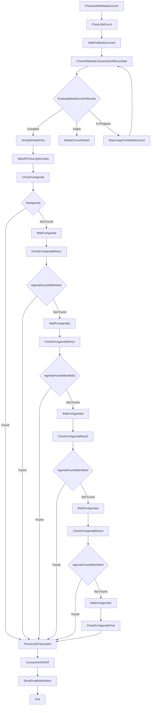

# Semantic Lighthouse Meeting Processor - Comprehensive Technical Documentation

## 1. APPLICATION OVERVIEW

**Purpose**: A serverless meeting processing pipeline that converts video recordings to audio, generates transcripts, uses AI to analyze transcripts with agenda context, and produces interactive HTML and PDF meeting minutes.

**Architecture**: Event-driven serverless system using AWS CDK with 6 Lambda functions, Step Functions orchestration, S3 storage, and AI services.

## 2. DETAILED WORKFLOW & DATA FLOW

### 2.1 Overall Workflow Triggers

The system has **two entry points**:

#### Entry Point 1: Video Upload Trigger
- **S3 Path**: `uploads/meeting_recordings/`
- **EventBridge Rule**: Monitors `Object Created` events
- **Action**: Triggers Step Functions state machine (`MeetingProcessingWorkflow`)

#### Entry Point 2: Agenda Upload Trigger  
- **S3 Path**: `uploads/agenda_documents/`
- **EventBridge Rule**: Monitors `Object Created` events
- **Action**: Triggers `AgendaDocumentProcessor` Lambda directly

### 2.2 Step Functions State Machine Workflow (`transcribe.asl.json`)

The main workflow processes video files through these states:



**Critical Integration Point**: The system waits for agenda documents for up to 5 minutes (5 x 60-second waits) before proceeding with a fallback agenda.

## 3. S3 BUCKET STRUCTURE & DATA PATHS

### 3.1 Input Paths
- **Video Uploads**: `uploads/meeting_recordings/{filename}.mp4`
- **Agenda Uploads**: `uploads/agenda_documents/{filename}.pdf`

### 3.2 Processing Paths
- **Audio Conversion**: `audio/{filename}_converted.mp3` or `audio/{filename}_part{N:02d}.mp3` (for chunked videos)
- **Transcripts**: `transcripts/{transcription_job_name}.json`
- **Agenda Raw Text**: `processed/agenda/raw_text/{correlation_key}.txt`
- **Agenda Analysis**: `processed/agenda/analysis/{correlation_key}.json`

### 3.3 Output Paths
- **HTML Results**: `analysis/{job_name}_analysis.html`
- **PDF Results**: `analysis/{job_name}_analysis.pdf`

### 3.4 Correlation Key System
**Critical for Integration**: Files are correlated using base filename without extension:
- Video: `uploads/meeting_recordings/board_meeting_2024_01_15.mp4`
- Agenda: `uploads/agenda_documents/board_meeting_2024_01_15.pdf`
- **Correlation Key**: `board_meeting_2024_01_15`

## 4. LAMBDA FUNCTIONS DETAILED ANALYSIS

### 4.1 MediaConvert Trigger (`lambda/src/mediaconvert_trigger/handler.py`)

**Purpose**: Converts video to audio, handles chunking for long videos

**Environment Variables**:
- `BUCKET_NAME`: S3 bucket name (from CDK)
- `OUTPUT_BUCKET`: Target bucket (from CDK)

**Hardcoded Values**:
- `CHUNK_DURATION_HOURS = 4`: Videos longer than 4 hours are split
- `DURATION_THRESHOLD_HOURS = 4`: Threshold for splitting decision
- `SIGNED_URL_EXPIRATION = 300`: 5 minutes for MediaInfo analysis
- **MediaConvert Role ARN**: `"arn:aws:iam::412072465402:role/MediaConvertServiceRole"` ⚠️ **HARDCODED ACCOUNT ID**
- **MediaConvert Queue**: `"arn:aws:mediaconvert:us-west-2:412072465402:queues/Default"` ⚠️ **HARDCODED ACCOUNT/REGION**

**Input/Output**:
- **Input**: S3 event or Step Functions payload
- **Output**: List of MediaConvert job IDs and audio output URIs

**Dependencies**: pymediainfo layer for video analysis

### 4.2 Processing Status Monitor (`lambda/src/verify_s3_file/handler.py`)

**Purpose**: Multi-function verification (S3 files, MediaConvert jobs, agenda checking)

**Environment Variables**:
- `BUCKET_NAME`: S3 bucket name

**Key Functions**:
1. **S3 File Verification**: Checks if files exist
2. **MediaConvert Job Status**: Batch checking of job completion
3. **Agenda Checking**: Looks for processed agenda by correlation key

**Agenda Check Logic**:
```python
analysis_key = f"processed/agenda/analysis/{correlation_key}.json"
raw_text_key = f"processed/agenda/raw_text/{correlation_key}.txt"
```

### 4.3 AI Meeting Analyzer (`lambda/src/process_transcript/handler.py`)

**Purpose**: Core AI processing - analyzes transcripts with agenda context

**Environment Variables** ⚠️ **KEY INTEGRATION POINTS**:
- `S3_BUCKET`: Bucket name
- `TRANSCRIPT_MODEL_ID`: `"us.anthropic.claude-3-7-sonnet-20250219-v1:0"`
- `TRANSCRIPT_MAX_TOKENS`: `"8000"`
- `TRANSCRIPT_TEMPERATURE`: `"0.2"`
- `TRANSCRIPT_PROMPT_TEMPLATE`: Full prompt text from config file
- `FALLBACK_AGENDA_TEXT`: Fallback agenda text from config file

**AI Model Configuration**:
- **Primary Model**: Claude 3.7 Sonnet via Bedrock
- **Region**: `us-west-2` (hardcoded in client)
- **Bedrock ARNs** (hardcoded in CDK):
  ```
  arn:aws:bedrock:us-west-2:${account}:inference-profile/us.anthropic.claude-3-7-sonnet-20250219-v1:0
  arn:aws:bedrock:us-east-1::foundation-model/anthropic.claude-3-7-sonnet-20250219-v1:0
  arn:aws:bedrock:us-east-2::foundation-model/anthropic.claude-3-7-sonnet-20250219-v1:0
  arn:aws:bedrock:us-west-2::foundation-model/anthropic.claude-3-7-sonnet-20250219-v1:0
  ```

**Key Processing Logic**:
1. **Transcript Format**: `[seg_X][speaker_label][HH:MM:SS] spoken text`
2. **Video Links**: Generates timestamped S3 presigned URLs
3. **Agenda Integration**: Uses agenda data if available, otherwise fallback text

### 4.4 Document PDF Generator (`lambda/src/html_to_pdf/handler.py`)

**Purpose**: Converts HTML meeting minutes to PDF

**Environment Variables**:
- `BUCKET_NAME`: S3 bucket name
- `LD_LIBRARY_PATH`: `"/opt/lib"` (for weasyprint layer)
- `FONTCONFIG_PATH`: `"/opt/fonts"` (for weasyprint layer)

**Dependencies**: WeasyPrint layer with fonts and libraries

### 4.5 Email Notification Sender (`lambda/src/email_sender/handler.py`)

**Purpose**: Sends completion notifications via SNS

**Environment Variables** ⚠️ **CRITICAL INTEGRATION POINT**:
- `SNS_TOPIC_ARN`: SNS topic ARN
- `NOTIFICATION_EMAIL`: `"user@example.com"` ⚠️ **HARDCODED DEFAULT EMAIL**

**Presigned URL Configuration**:
- `PRESIGNED_URL_EXPIRATION = 7 * 24 * 60 * 60`: 7 days (hardcoded)

**Email Template** (hardcoded in function):
```
Subject: "Your meeting transcript is ready"
Message includes:
- HTML download link (interactive)
- PDF download link (printable)
- 7-day expiration notice
```

### 4.6 Agenda Document Processor (`lambda/src/agenda_processor/handler.py`)

**Purpose**: Processes uploaded agenda PDFs using Textract and AI analysis

**Environment Variables**:
- `BUCKET_NAME`: S3 bucket name
- `STATE_MACHINE_ARN`: Step Functions ARN for triggering combined processing
- `AGENDA_MODEL_ID`: `"us.anthropic.claude-sonnet-4-20250514-v1:0"`
- `AGENDA_MAX_TOKENS`: `"65535"`
- `AGENDA_TEMPERATURE`: `"0.1"`
- `AWS_REGION`: For Bedrock client region

**Hardcoded Configuration**:
- `MAX_TEXTRACT_WAIT_TIME = 15 * 60`: 15 minutes max wait
- `TEXTRACT_POLL_INTERVAL = 30`: 30-second polling

**AI Model**: Nova Premier (different from transcript analysis)
- **Bedrock ARNs**:
  ```
  arn:aws:bedrock:us-east-1::foundation-model/amazon.nova-premier-v1:0
  arn:aws:bedrock:us-west-2::foundation-model/amazon.nova-premier-v1:0
  ```

**Output Structure**: JSON with meeting metadata, participants, agenda items, etc.

## 5. CONFIGURATION FILES & TEMPLATES

### 5.1 AI Prompt Templates

**Transcript Analysis Prompt** (`config/prompts/transcript-analysis.txt`):
```
Go through this transcript for a board meeting. The context of the board meeting should be clear from the agenda and the transcript.
I want you to go through this and look for the segments where there is a vote taking place or where there is a topic transition.
Refer to the agenda for more info:

AGENDA:
{agenda}

TRANSCRIPT:
{formatted_transcript}
```

**Fallback Agenda** (`config/prompts/fallback-agenda.txt`):
```
GENERAL MEETING AGENDA

This is a standard school board meeting. Please analyze the transcript for:
1. Opening remarks and introductions
2. Review of previous meeting minutes
...
```

**Agenda Analysis Prompt** (`lambda/src/agenda_processor/agenda_analysis_prompt.txt`):
- Structured JSON extraction for meeting metadata
- Participant identification
- Agenda item analysis

## 6. CRITICAL INTEGRATION POINTS FOR STACK MERGING

### 6.1 Environment Variables That Need Database Integration

**Current Environment Variable Sources → Suggested Database Replacements**:

1. **Email Configuration**:
   - **Current**: `NOTIFICATION_EMAIL` env var in `email_sender`
   - **Database**: User preferences table with email settings
   - **Code Change**: Replace `os.environ.get("NOTIFICATION_EMAIL")` with database lookup

2. **AI Model Configuration**:
   - **Current**: Multiple model ID env vars
   - **Database**: System configuration table
   - **Variables**: `TRANSCRIPT_MODEL_ID`, `AGENDA_MODEL_ID`, `TRANSCRIPT_MAX_TOKENS`, etc.

### 6.2 Hardcoded Values Requiring Parameterization

1. **AWS Account/Region Specific**:
   - MediaConvert role ARN (line 103 in mediaconvert_trigger)
   - MediaConvert queue ARN (line 121 in mediaconvert_trigger)
   - Multiple Bedrock model ARNs in CDK

2. **Processing Configuration**:
   - Video chunk duration (4 hours)
   - Presigned URL expiration times
   - Textract polling intervals

### 6.3 Resource Naming Strategy

**Current CDK Naming**:
```typescript
const stackSuffix = cdk.Names.uniqueId(this).toLowerCase().replace(/[^a-zA-Z0-9-]/g, "").slice(0, 8);
const uniquePrefix = `${resourcePrefix}-${stackSuffix}`;
```

**Function Names**:
- `${uniquePrefix}-video-to-audio-converter`
- `${uniquePrefix}-processing-status-monitor`
- `${uniquePrefix}-ai-meeting-analyzer`
- etc.

### 6.4 S3 Bucket Configuration

**Current**: Can use explicit bucket name or auto-generate
```typescript
bucketName: props.s3BucketName, // Optional explicit name
```

**Integration Consideration**: Other stack may need shared bucket access

### 6.5 SNS Topic Integration

**Current**: Creates own topic
```typescript
topicName: `${uniquePrefix}-notifications`
```

**Integration**: May need to use shared notification infrastructure

## 7. DEPENDENCIES & EXTERNAL SERVICES

### 7.1 AWS Services Used
- **S3**: File storage and event triggers
- **Lambda**: Compute functions
- **Step Functions**: Workflow orchestration
- **MediaConvert**: Video-to-audio conversion
- **Transcribe**: Speech-to-text
- **Textract**: PDF text extraction
- **Bedrock**: AI model inference (Claude, Nova)
- **SNS**: Email notifications
- **EventBridge**: S3 event routing
- **IAM**: Permissions management

### 7.2 Lambda Layers
- **pymediainfo_layer**: Video metadata extraction
- **weasyprint**: PDF generation with fonts and dependencies

### 7.3 Python Dependencies
- **transcript processor**: `markdown==3.5.1`
- **Other functions**: Standard AWS SDK and built-in libraries

## 8. SECURITY & PERMISSIONS MODEL

### 8.1 IAM Role Structure
- Each Lambda has individual execution role
- Step Functions has its own service role
- Cross-service permissions granted via CDK

### 8.2 S3 Permissions
- Read/write access to specific prefixes
- EventBridge notifications enabled
- Block all public access

### 8.3 Bedrock Permissions
- Different models for different functions
- Regional fallback model ARNs
- Inference profile permissions

## 9. MONITORING & ERROR HANDLING

### 9.1 Step Functions Error Handling
- Retry policies on all Lambda invocations
- Catch blocks with specific error handling
- Multiple failure states with descriptive errors

### 9.2 Lambda Timeout Configuration
- Video processing: 15 minutes
- PDF generation: 5 minutes  
- AI analysis: 15 minutes
- Others: 1-5 minutes

## 10. RECOMMENDATIONS FOR STACK INTEGRATION

### 10.1 Immediate Actions Required
1. **Replace hardcoded account IDs** in MediaConvert configurations
2. **Parameterize email configuration** for database integration
3. **Review resource naming** for consistency with other stack
4. **Assess bucket sharing strategy** between stacks

### 10.2 Database Schema Suggestions
```sql
-- User preferences
CREATE TABLE user_preferences (
    user_id VARCHAR(255) PRIMARY KEY,
    notification_email VARCHAR(255),
    preferred_output_format VARCHAR(50)
);

-- System configuration
CREATE TABLE system_config (
    config_key VARCHAR(255) PRIMARY KEY,
    config_value TEXT,
    description TEXT
);
```

### 10.3 Code Modification Points
- **Email sender**: Replace env var lookup with database query
- **Model configuration**: Centralize in database
- **Resource ARNs**: Use CDK parameters instead of hardcoded values

This documentation provides the exact information needed to understand data sources, integration points, and modification requirements for merging your stack with the other half of the application.
